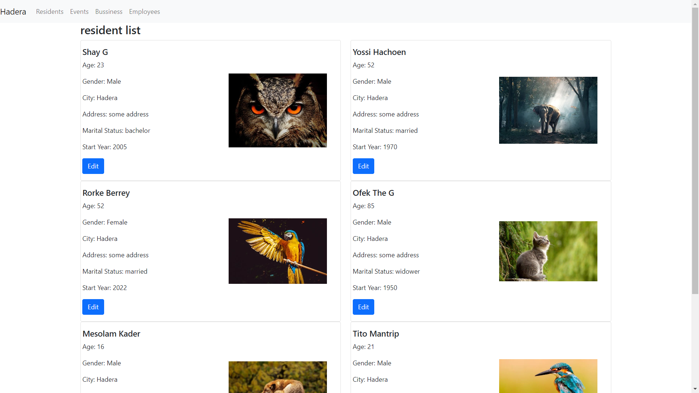
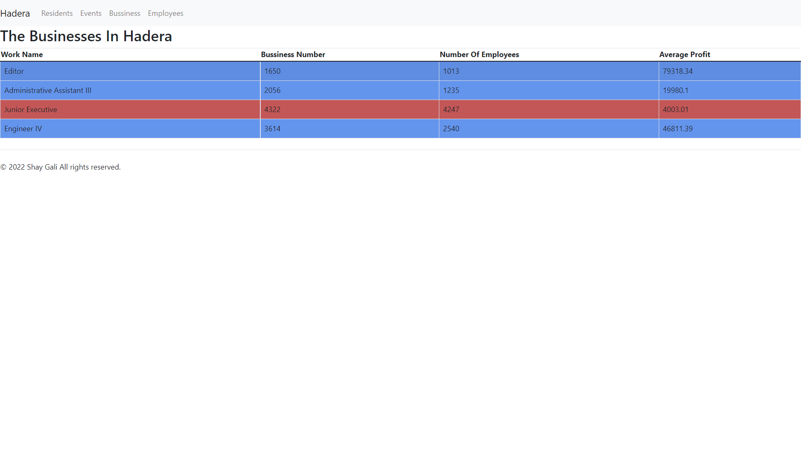
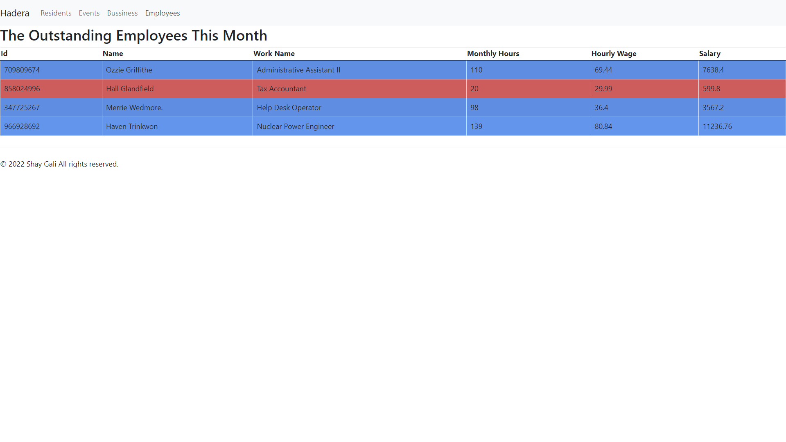

# City Website

This project was built as part of an Angular course.

The project was to build a website for a specific municipality with the option to edit the information on the website.

## <ins>Pages</ins>

### <ins> Home Page</ins>

The website home page

### <ins>Residents</ins>

Represents the residents of the city, there are two routes here:

#### <ins>Residents Cards</ins>

Cards representing the residents with information about them and their photo and a button that takes us to edit the information about that resident.

#### <ins>Edit Residents</ins>

This page allows us to edit the information about that resident, The information will change throughout the app in real time.

### <ins>Event Page</ins>

Represents the events of the city, there are two routes here:

#### <ins>Events Table</ins>

This page has a table with all the events that are in the city.
The color of the number of participants varies according to their quantity.

At the end of each column there is a button that allows you to edit the information about that event

#### <ins>Edit Event Page</ins>

This page allows us to edit the information about that event, the information will change throughout the app in real time.

### <ins>Bussiness Page</ins>

This page contains the table of businesses in the city. The background color varies according to the average profit of the business.

### <ins>Employees Page</ins>

This page has the table of the outstanding employees of the month. The background color varies according to the employee's salary

This project was generated with [Angular CLI](https://github.com/angular/angular-cli) version 13.2.5.

## Install Dependencies

Run `npm install` for install project dependencies

## Development server

Run `ng serve` for a dev server. Navigate to `http://localhost:4200/`. The app will automatically reload if you change any of the source files.

## Build

Run `ng build` to build the project. The build artifacts will be stored in the `dist/` directory.

&copy; 2022 Shay Gali All rights reserved.
